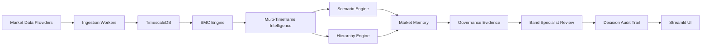
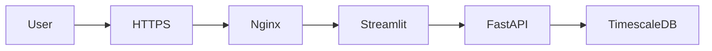

# Architecture

Quasar Enterprise AI Delivery Swarm converts live market data into advisory-only, specialist-reviewed intelligence with governance evidence and auditability.

## Intelligence Pipeline

## Deployment Topology

## Component Responsibilities

| Component | Responsibility |
| --- | --- |
| Market Data Providers | Provide MCX and Forex candle data. |
| Ingestion Workers | Fetch, normalize, and persist market candles. |
| TimescaleDB | Store candle history, market intelligence, specialist persistence, and audit data. |
| SMC Engine | Produces market-structure labels for downstream intelligence. |
| Multi-Timeframe Intelligence | Aggregates structure across timeframes into a market snapshot. |
| Scenario Engine | Builds dominant and alternative advisory scenarios. |
| Hierarchy Engine | Reviews higher/lower timeframe agreement and conflict. |
| Market Memory | Tracks structure persistence and recent evolution. |
| Governance Evidence | Links specialist conclusions to supporting system evidence. |
| Band Specialist Review | Runs role-specific specialist review and final advisory assessment. |
| Decision Audit Trail | Records staged evidence for review and runtime continuity. |
| Streamlit UI | Presents charts, specialist analysis, final assessment, and audit console. |

## Safety Boundary

Quasar is advisory-only. It does not place trades, does not generate execution instructions, and does not produce buy/sell signals.
